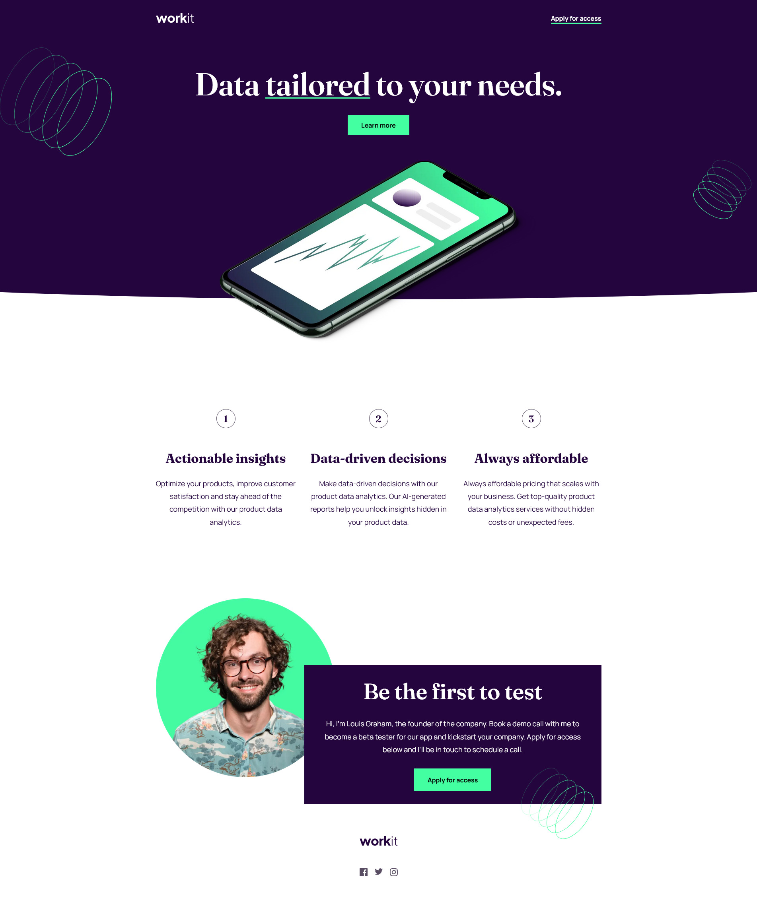

# Frontend Mentor - Workit landing page solution

This is a solution to the [Workit landing page challenge on Frontend Mentor](https://www.frontendmentor.io/challenges/workit-landing-page-2fYnyle5lu). Frontend Mentor challenges help you improve your coding skills by building realistic projects. 

## Table of contents

- [Overview](#overview)
  - [The challenge](#the-challenge)
  - [Screenshot](#screenshot)
  - [Links](#links)
- [Author](#author)

## Overview

### The challenge

Users should be able to:

- View the optimal layout for the interface depending on their device's screen size
- See hover and focus states for all interactive elements on the page

### Screenshot

### Links

- Solution URL: [Frontend Mentor](https://www.frontendmentor.io/solutions/workit-landing-page-with-grid-and-flexbox-6CtJiy6wsI)
- Live Site URL: [GitHub Pages](https://simoncassan.github.io/Front-end-Mentor_challenges/Front-end-Mentor_workit-landing-page)

## Author

- GitHub - [@SimonCassan](https://github.com/SimonCassan)
- Frontend Mentor - [@SimonCassan](https://www.frontendmentor.io/profile/SimonCassan)
