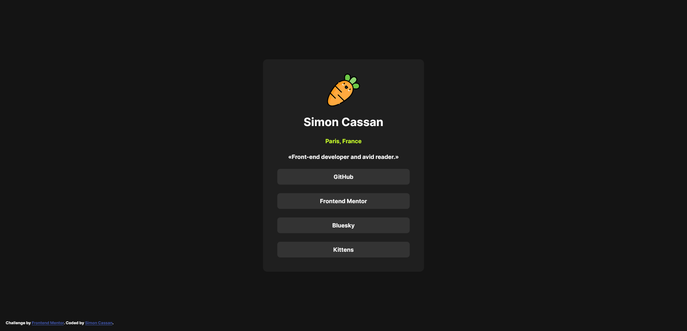

# Frontend Mentor - Social links profile solution

This is a solution to the [Social links profile challenge on Frontend Mentor](https://www.frontendmentor.io/challenges/social-links-profile-UG32l9m6dQ). Frontend Mentor challenges help you improve your coding skills by building realistic projects. 

## Table of contents

- [Overview](#overview)
  - [The challenge](#the-challenge)
  - [Screenshot](#screenshot)
  - [Links](#links)
- [Author](#author)

## Overview

### The challenge

Users should be able to:

- See hover and focus states for all interactive elements on the page

### Screenshot

### Links

- Solution URL: [Frontend Mentor](https://www.frontendmentor.io/solutions/social-links-profile-with-flexbox-s-g-xObFC0)
- Live Site URL: [Github-pages](https://simoncassan.github.io/Front-end-mentor_Social_links_profile/)

## Author

- GitHub - [SimonCassan](https://github.com/SimonCassan)
- Frontend Mentor - [@SimonCassan](https://www.frontendmentor.io/profile/SimonCassan)
